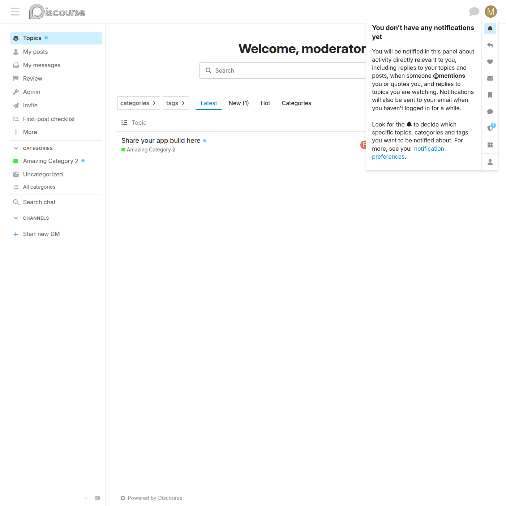
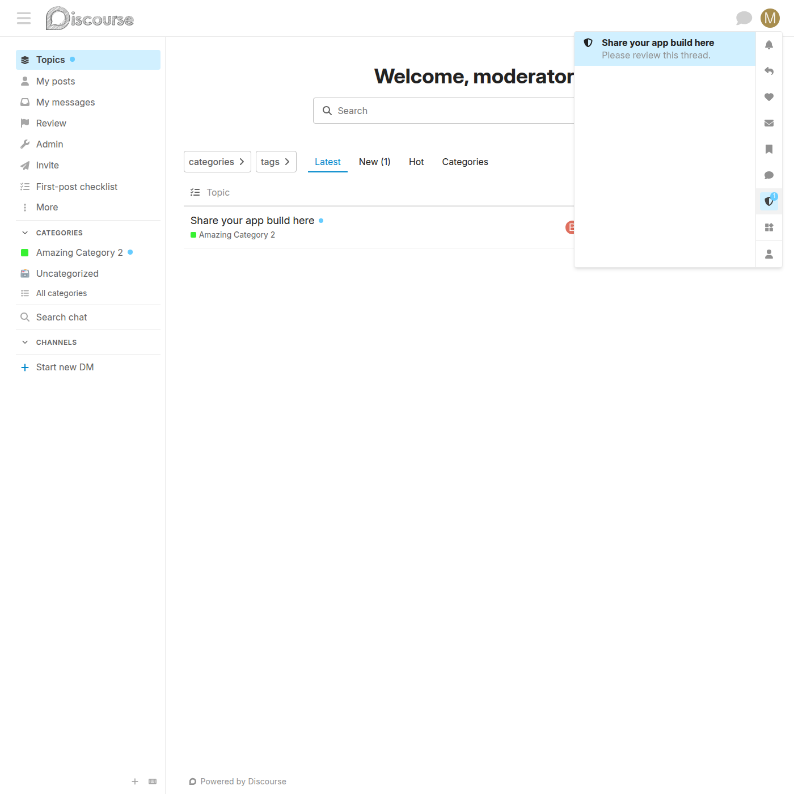
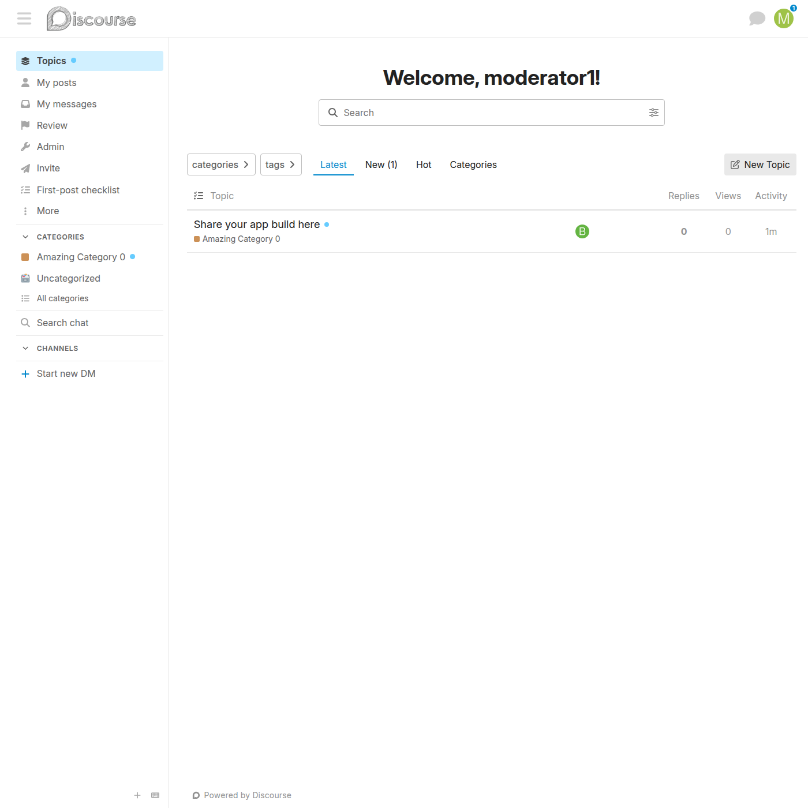
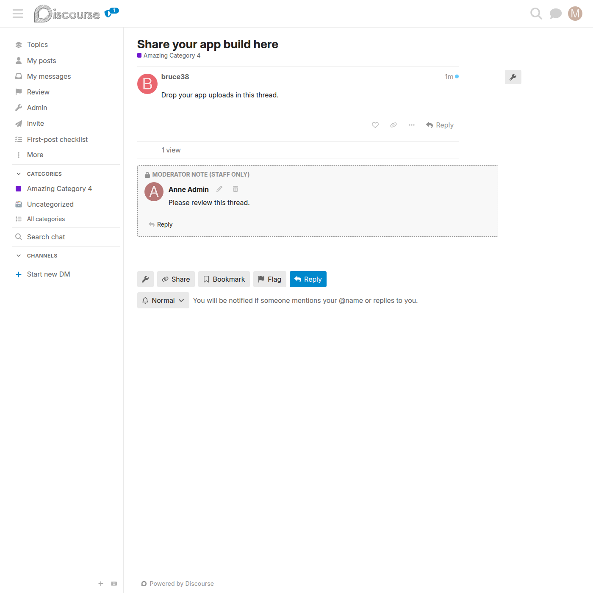
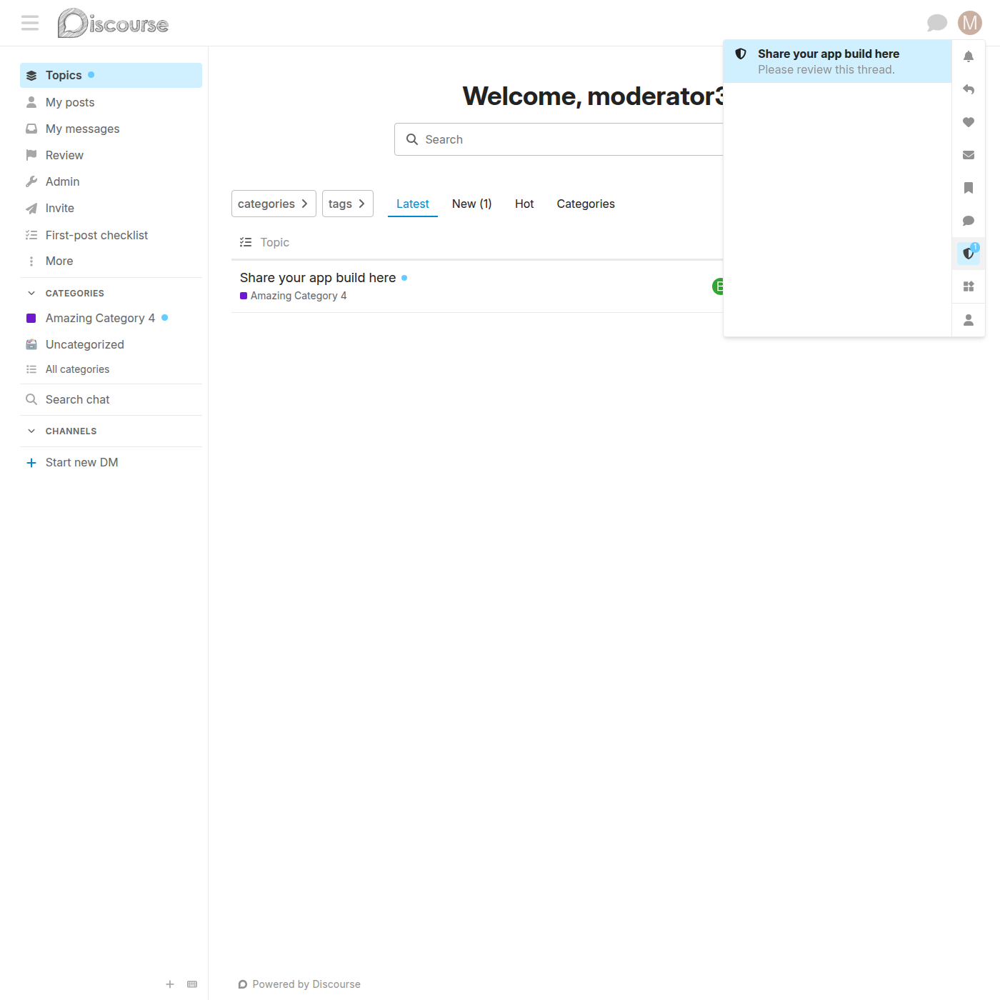

# Moderator-notes user-menu tab

A staff-only tab in the user menu — alongside the notifications bell — that surfaces the [private moderator notes](private-moderator-note.md) set on topics across the forum.

## What it is

While the plugin is enabled (`mod_categories_enabled`), staff (moderators and admins) get an extra **shield** tab in their user menu. It carries an unread count and lists recent moderator notes.

## What it looks like

### The shield tab in the user menu

The shield tab appears in the user-menu icon strip, next to the notifications bell, with an unread-count badge.

### The moderator-notes panel

Opening the tab lists recent moderator notes — each entry shows the topic title and the note, and links to the topic. Unread entries are highlighted.

## Behaviour

- Visible **only to staff** — the tab does not render for regular users.
- The badge count is the number of topics whose moderator note (or a reply to it) has had activity since the staff member last opened the tab.
- Opening the tab marks the feed as seen and clears the count.
- Each entry links directly to the topic's last post.

## Pop-up notifications

Setting a moderator note, or replying to one, also sends a **real Discourse notification** to the other staff members — it appears in the notifications bell and pops up live, like a flag/review notification. The notification links to the topic's last post.

## Header-level indicators

Because the shield-tab's unread count is only visible when the user menu is open, the plugin also surfaces the same count in two places that are visible **without** opening the menu:

### Header shield pip

A small shield pip is rendered in the page header next to the avatar whenever the staff member has unread moderator notes (`currentUser.mod_note_unread_count > 0`). Clicking the pip opens the user menu and switches it to the moderator-notes tab, matching the existing shield-tab behaviour.

### Browser tab-title prefix

The plugin prefixes `document.title` with `(N)` mirroring the bell's behaviour, so an inactive browser tab still announces unread moderator notes. The prefix is applied via a pure helper (`applyUnreadPrefix`) wrapped around the document's `title` setter so route transitions re-add it automatically.

Both indicators are reactive:

- **On page load** the count comes from the bootstrapped `currentUser.mod_note_unread_count`.
- **When the staff member opens the shield tab** the panel sets `currentUser.mod_note_unread_count` to 0 — both the pip (a tracked-property render) and the title prefix (a property observer) clear immediately.
- **When a new note or reply arrives** the server publishes a `{ delta: 1 }` payload on `/mod-note-unread-count/{user_id}` (alongside the existing `/notification-alert/` push that drives the bell). The client subscribes to this dedicated channel and bumps the local count, so the pip + title prefix update without a hard refresh.
- **Marking the feed as seen on another tab** also publishes a `{ reset: true }` payload on the same channel, so multi-tab sessions stay in lockstep.

## Implementation

- A topic records `mod_topic_private_note_activity_at` whenever its note or a reply to it changes.
- Each staff user records `mod_notes_seen_at` (when they last opened the tab).
- `CurrentUserSerializer` exposes `mod_note_unread_count` — topics with activity newer than `mod_notes_seen_at`.
- Endpoints: `GET /discourse-mod-categories/notes-feed` (the list) and `POST /discourse-mod-categories/notes-feed/seen` (mark the feed read). Both are staff-gated.
- The tab is registered with `api.registerUserMenuTab`; its panel is the `ModNotesPanel` component.
- The header pip is a Glimmer component (`ModNoteHeaderPip`) rendered via the `before-header-panel` plugin outlet, gated on `currentUser.staff && mod_note_unread_count > 0`.
- The title-prefix logic lives in `lib/mod-note-unread-title.js` as pure `applyUnreadPrefix(title, count)` / `stripUnreadPrefix(title)` helpers; the `discourse-mod-note-header-indicators` initializer wraps `document.title`'s setter so route transitions don't drop the prefix.
- Live updates come from a dedicated MessageBus channel `/mod-note-unread-count/{user_id}`, published from `notify_staff_of_note` (a `{ delta: 1 }` bump per recipient) and from `notes_feed_seen` (a `{ reset: true }` payload to the staff member themselves).
