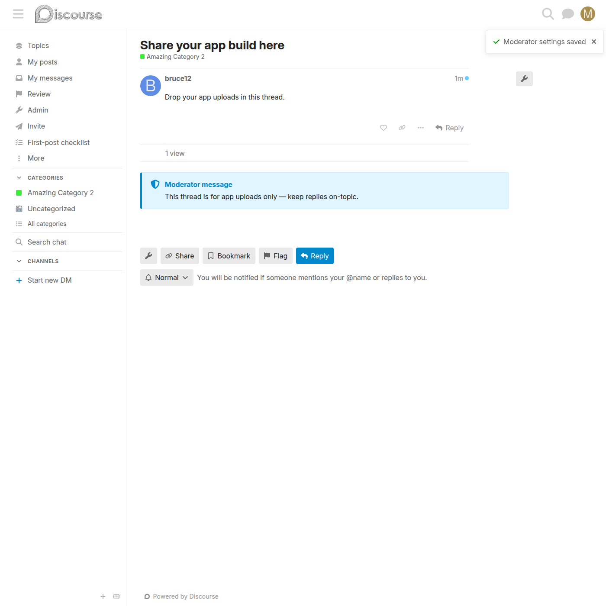

# Per-topic footer message

Feature switch: **`topic_footer_message_enabled`** — boolean, default `true`, client-exposed.

A moderator-set message pinned to the bottom of a single topic.

## How a moderator sets it

Topic → admin (wrench) menu → **Moderator Actions** → **Pinned footer message**
field → **Save**.

The **Moderator Actions** modal is split into two sections — *What users
see* (the footer message and reply prompt) and *Moderation tools* (reply
approval and the private note). Saving any field shows a green "Moderator
settings saved" toast and closes the modal.

## What it looks like

## Behaviour

- Renders in an official-notice box at the bottom of the topic — below the
  last post, above suggested topics — with a shield icon and a
  **Moderator message** label.
- The message is cooked as **Markdown**: plain text, bare URLs, links
  (`[text](url)`), and basic formatting all render correctly. It is stored
  raw; only the display is cooked.
- Not shown in private messages, or when the message is blank.
- Appears, updates, and disappears live when saved — no page reload.

## Storage & API

- **Topic custom field:** `mod_topic_footer_message` (string)
- **Endpoint:** `PUT /discourse-mod-categories/topic/:topic_id` with the `footer_message` param
- Only moderators and admins may set it (`Guardian#can_manage_mod_messages?`); regular and anonymous users get `403`.

## Related

The same bottom-of-topic area also shows a [pinned post](pin-post-to-bottom.md) when one is set.
